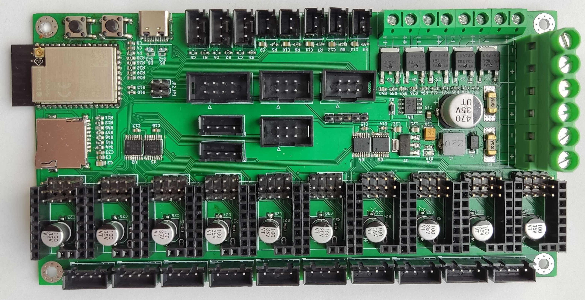
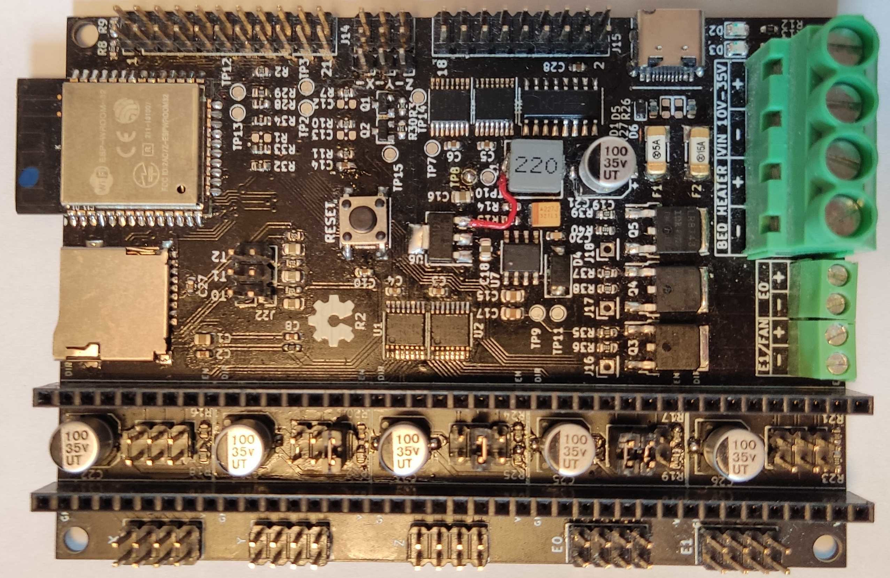
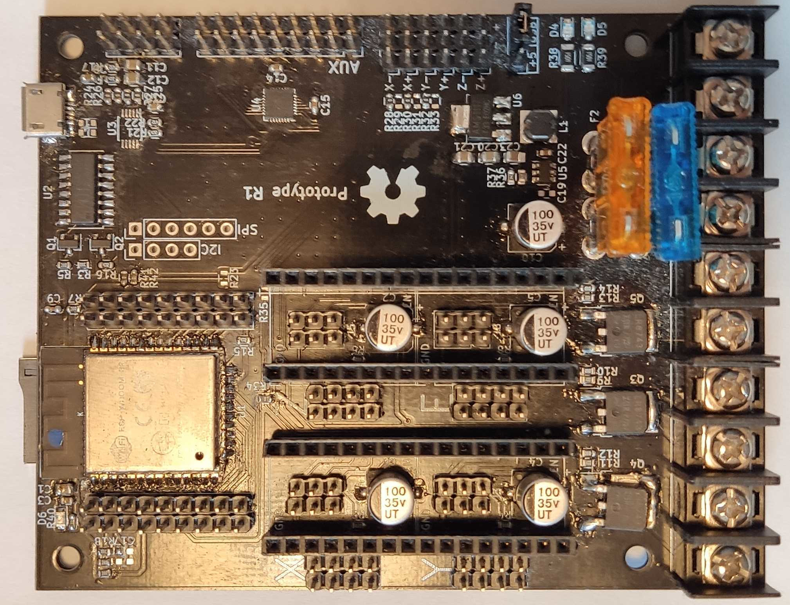

# ESP32Controller

ESP32Controller is an open source hardware controller for 3d printers, laser cutter/engraver and other CNC machines.

---

### Overview

There are currently 3 iterations of the board all based on either the ESP32 or ESP32-S2. The ESP32 is a dual core Xtensa LX6 with 34 GPIOs and the ESP32-S2 is a single core Xtensa LX7 with 43 GPIOs and built-in USB support.

  Board | MCU      | Drivers | Mosfets | Thermistors |  Comm. |
  ------|----------|-------- | ------- | ----------- | ------ |
  R3    | ESP32-S2 | 10      | 5       | 5           | USB
  R2    | ESP32    | 5       | 3       | 3           | USB to UART
  R1    | ESP32    | 4       | 3       | 2+2         | USB to UART

### R3 Board

This third iteration of the board moves away from the ESP32 to the ESP32-S2 to gain 9 GPIOs at the cost of having only a single core (albeit more efficient).

Using the newly available GPIOs the number of mosfets and thermistors on the board have increased to 5.

In the R2 board the I2S stream has been used to drive 5 drivers but could address more than that. In the R3 board the number of drivers increased to 10 as the cost of adding support for that many drivers is minimal and should cover most of the use cases.

This board was also designed with TMC2209 drivers in mind (although not required), by allowing UART communication for 8 of the 10 drivers through jumpers on the board and connecting the diag pins to the endstops for the first three driver slots allowing sensorless homing without external jumper wires.

  - 10 pololu stepper drivers over I2S
  - 5 mosfets
  - 5 thermistors
  - 3 endstops (connected to stepper DIAG pins for the first three drivers)
  - USB type C -- OTG port on the ESP32-S2
  - micro SD card slot
  - jumpers for UART communication to the first 8 drivers

### R2 Board

The primary issue with using an ESP32 as the main controller for a CNC controller is the general lack of GPIOs on the controller limiting considerably the number of drivers, thermistors and endstpos that can be controlled.

This second iteration main goal was to move away from direct GPIO control of the drivers and instead move to use the I2S stream to provide real time and highly accurate stepper pulses while only using 3 pins on the ESP32.

The redesign also removed some of the unused features of the R1 design most notably the external ADC and the GPIO expander.

  - 5 pololu stepper drivers over I2S
  - 3 mosfets
  - 3 thermistors
  - 3 endstops
  - USB type C -- CH340G USB to UART converter
  - micro SD card slot

### R1 Board

This is the first standalone board based on the ESP32. This board was designed as a barebone controller with the minimum required to support an i3 style printer.
 
  - 4 pololu stepper drivers (X, Y, Z, E0) with direct GPIO connection
  - 3 mosfets (Bed, Hotend, Part cooling fan)
  - ADS1015 external ADC for the thermistors (over i2c)
    - 2 thermistors to the ESP32
    - 2 thermistors to the ADS1015
  - SX1509 GPIO expander (over i2c)
    - 3 endstops direct to the the ESP32
    - 3 endstops to the GPIO expander
- USB micro b -- CH340G USB to UART converter
- micro SD card slot

